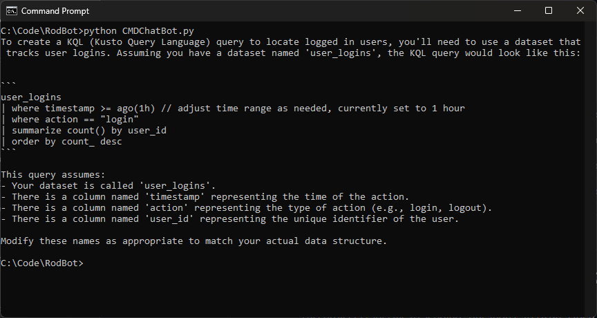

# Command Line Chatbot for Azure Open AI

This project is specific to sending "questions" to Azure Open AI ChatGPT (ChatGPT-4, in this case) and getting responses. This is a simple project to show how to call for information from outside the code to supply things like configuration and messages. 

## Requirements

* An Azure subscription

* Access granted to Azure OpenAI in the desired Azure subscription. Currently, access to this service is granted only by application. You can apply for access to Azure OpenAI by completing the form at https://aka.ms/oai/access

* Python 3.7.1 or later version

* The following Python libraries: os, requests, json

* An Azure OpenAI Service resource with a model deployed. For more information about model deployment, see the resource deployment guide.

* Install the Open AI client library: pip install openai

* Other library installation requirements in the requirements.txt file

## Files

Place all the files in their own, same directory.

* CMDChatBot.py - This is the main app - the Python code.

* config.json - This is the file the code looks for that contains your specific API key, deployed model name, API base (endpoint), and API version. You'll need to modify this with your information.

* question.json - This is the file that contains the question you want to ask. Modify this to change questions.

* requirements.txt - Other library installation requirements (pip install <library> --user)

## Command line

python CMDChatBot.py

